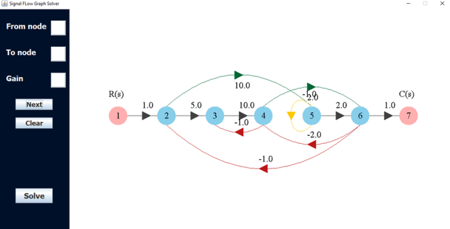
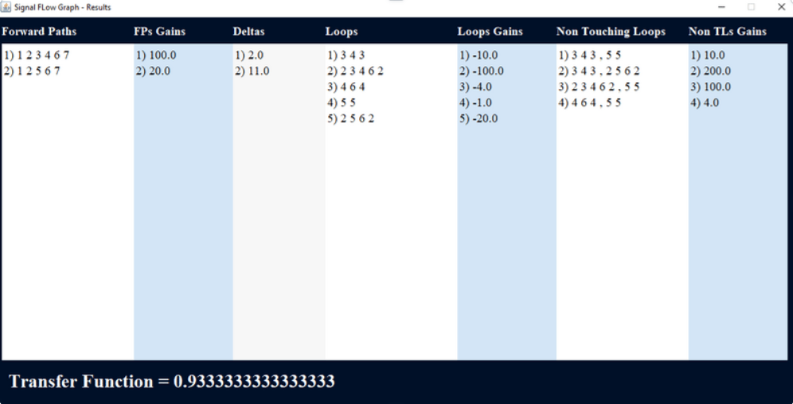

# Signal Flow Graph
Signal flow graph is representation of the system using Mason’s Rule Formula

## Problem statment
Mason’s rule for reducing a signal-flow graph to a single transfer function requires
the application of one formula. The formula was derived by S. J. Mason when he
related the signal-flow graph to the simultaneous equations that can be written
from the graph

